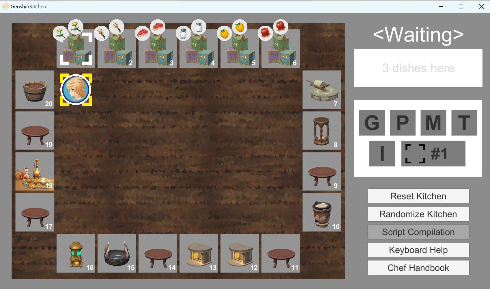

<div align=center>

# Genshin Kitchen: CS211 Final Projects

[中文](#项目介绍) /
[English](#project-introduction)

南方科技大学2023秋季 `CS211 数字逻辑(H)`期末大作业：**原神厨房**

Southern University of Science and Technology, Autumn 2023
`CS107 Digital Logics(H)` Final Project: **Genshin Kitchen**

基于[已有软件客户端](https://github.com/Yan-ice/GenshinKitchen_2023F)使用Verilog开发相应的硬件开发控件实现接口，
支持通过开发板操作游玩原神厨房游戏

Based on the [existing software client](https://github.com/Yan-ice/GenshinKitchen_2023F) development
of the corresponding hardware development controls to achieve the interface.
Support playing Genshin Kitchen game through the Embedded Development Board.

开发列表 / Developers :  [@Frosky Lrupotkin](https://github.com/FrostyHec)
| [@Super](https://github.com/redhecker)
| [@hyj2003](https://github.com/hyj2003)

得分 / Score : 114.8/100 (14.8 bonus)

**Enjoy the game!**



</div>

## Project Introduction

## 项目介绍

本章节主要介绍现有仓库架构与本项目的基本功能信息，详细的硬件代码框架可参考

### 项目结构


```
DarkChess
├── Code                        # 源代码
│   ├── Docs                    # GenshinKitchen介绍与需求文档
│   ├── GenshinKitchen_Client   # 原神厨房软件客户端
│   ├── HDL_Framework           # 硬件端
│   ├── QuickStart              # 原工程示例脚本
│   └── Script                  # 展示用脚本
├── Docs             
│   ├── Developing              # 开发过程中文件
│   ├── Reference               # 参考资料
│   └── Report                  # 答辩资料,报告与bonus视频       
├── .gitignore
├── LICENSE
└── README.md
```

### 功能列表与技术实现

在已有软件客户端的基础上，实现了[开发文档](https://github.com/Yan-ice/GenshinKitchen_2023F)
中所需要实现的相应接口，具体实现了如下基本功能

- [x] 硬件控制
  -  [x] 开发板操作含义设计
  -  [x] 开发板信号收集
  -  [x] 客户端信号的开发板显示
- [x] 软硬件交互
  -  [x] 开发板操作编码
  -  [x] 软硬件信号交互处理(基于UART)
- [x] 脚本模式
  -  [x] 脚本读取
  -  [x] 脚本信号解析
  -  [x] 单脚本多信号的映射处理(关键在于状态机设计)
- [x] 脚本设计
  -  [x] 展示脚本设计
  -  [x] 脚本提速优化

## 开发总结

### 开发日志


### 技术总结

1. 硬件开发时刻记得硬件

## 后记