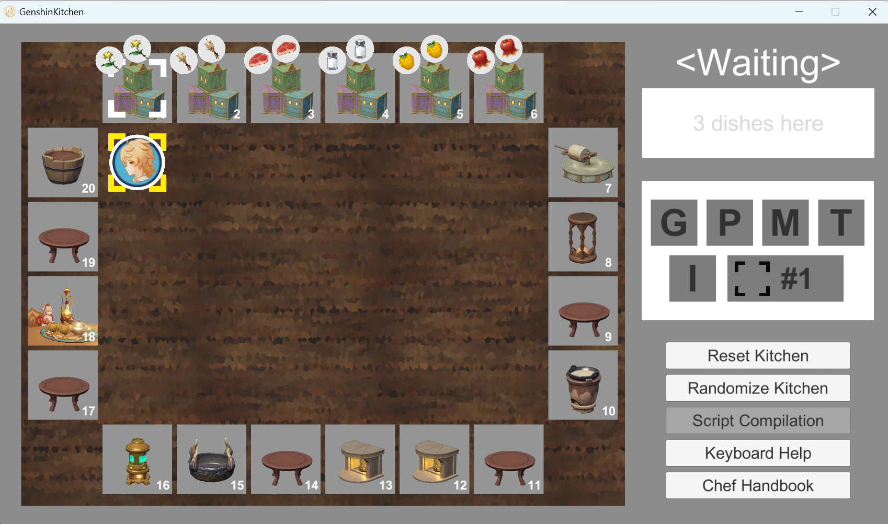

<div align=center>

# Genshin Kitchen: CS211 Final Projects

[中文](#项目介绍) /
[English](#project-introduction)

南方科技大学2023秋季 `CS211 数字逻辑(H)`期末大作业：**原神厨房**

Southern University of Science and Technology, Autumn 2023
`CS107 Digital Logics(H)` Final Project: **Genshin Kitchen**

基于[已有软件客户端](https://github.com/Yan-ice/GenshinKitchen_2023F)使用Verilog开发相应的硬件开发控件实现接口，
支持通过开发板操作游玩原神厨房游戏

Based on the [existing software client](https://github.com/Yan-ice/GenshinKitchen_2023F) development
of the corresponding hardware development controls to achieve the interface.
Support playing Genshin Kitchen game through the Embedded Development Board.

开发列表 / Developers :  [@Frosky Lrupotkin](https://github.com/FrostyHec)
| [@Super](https://github.com/redhecker)
| [@hyj2003](https://github.com/hyj2003)

得分 / Score : 114.8/100 (14.8 bonus)

**Enjoy the game!**



</div>

## Project Introduction

This section mainly introduces the existing repository architecture and the basic functions of this
project. For a detailed introduction to the hardware code framework, please refer to
the [project documentation](Docs/Report/Digital Logic Document(祝超,何俞均,黄政东).pdf).

### Project Structure

```
DarkChess
├── Code                        # Source code
│   ├── Docs                    # GenshinKitchen introduction and requirements documentation
│   ├── GenshinKitchen_Client   # GenshinKitchen software client
│   ├── HDL_Framework           # Hardware code
│   ├── QuickStart              # Original project example scripts
│   └── Script                  # Demo scripts
├── Docs             
│   ├── Developing              # Development process files
│   ├── Reference               # Reference materials
│   ├── Requirements            # Project Requirements
│   └── Report                  # Presentation materials, reports, and bonus videos       
├── .gitignore
├── LICENSE
└── README.md
```

### Function List and Technical Implementation

Based on the existing software client, the corresponding interfaces required by
the [development documentation](https://github.com/Yan-ice/GenshinKitchen_2023F) have been
implemented. The specific basic functionalities implemented are as follows:

- [x] Hardware Control
    - [x] Design of development board operation representations
    - [x] Collection of development board signals
    - [x] Display of client signals on the development board
- [x] Software and Hardware Interaction
    - [x] Encoding of development board operations
    - [x] Interaction processing of software and hardware signals (based on UART)
- [x] Script Mode
    - [x] Script reading
    - [x] Script signal parsing
    - [x] Mapping processing of multiple signals in a single script (important works are on state
      machine design)
- [x] Script Design
    - [x] Demo script design
    - [x] Script speed optimization

### Interaction Description


## Development Summary

Duration: About 3.5 weeks

Some insights:

1. Always remember that we are designing hareware. When writing Verilog
   code, be sure to think about the circuit components corresponding to the code. Especially for
   behavior models, always remember that the written logic needs to correspond to the appropriate
   MUX/Decoder to avoid synthesizing unexpected latches, etc.

2. Concepts like Verilog's reg, wire, blocking and non-blocking assignments, arrays, etc., are **all
   syntactic concepts**! Writing a variable as reg does not mean it will actually synthesize into a
   register in the circuit. (Maybe chisel's design is better...) Similarly, there is no concept of
   blocking assignments in circuits (In synchronous circuits design, there are only sequential
   and combinational parts). "Variables" and "arrays" are fundamentally different in implementation
   compared to software (there is no concept of array overflow, but compiler might remove
   redundant(maybe actually due to some typo😡) wires.

3. Verification and development are both very important. At the beginning of development, think
   about how to test and verify the program (It's best to find a very comfortable and quick
   verification method ~~that is Chisel~~), which can save a lot of time. Try not to bring bugs to
   the development board, which will be difficult for debugging.

4. Verilog's syntax and checking are honestly too weak. Highly recommended to use [Chisel]
   (https://www.chisel-lang.org/) (It is also a hardware description language, if
   you know Verilog, mastering Chisel's basic usage is actually very quick). Chisel can catch many
   errors at the compilation level and can also very conveniently perform verification (~~for
   detailed usage examples, please refer to [CPUdemo](https://github.com/FrostyHec/CPUdemo)~~).

## Postscript

This was almost the first time in life to engage in hardware design and development. Additionally,
the development started just when learning sequential logic (it could have been arranged earlier, as
sequential logic is the most important part of digital logic and must be deeply understood and
mastered). This led to project development always using software development thinking (also
unintentionally mixing in some asynchronous circuit design patterns), resulting in difficulties
and failures during the development. Thanks to teammates [@Super](https://github.com/redhecker)
and [@hyj2003](https://github.com/hyj2003) for their cooperation, and thanks to the CS211 teacher
and teaching assistants for their suggestions. After several late-night debugging sessions on the
development board, the project was finally completed, and some insights into hardware design and
development were gained.

It was through these failures that insights were gained, which ultimately helped us complete
the [CPUdemo](https://github.com/FrostyHec/CPUdemo) project in the next semester. Thanks to the
hardware development knowledge learned over the past year (although I might not pursue hardware
development in the future D: . Later I will write some notes to summarize the gains of this
year).

——Frosty

## 项目介绍

本章节主要介绍现有仓库架构与本项目的基本功能信息，详细的硬件代码框架介绍可参考[项目文档](Docs/Report/Digital Logic Document(祝超,何俞均,黄政东).pdf)

### 项目结构

```
DarkChess
├── Code                        # 源代码
│   ├── Docs                    # GenshinKitchen介绍与需求文档
│   ├── GenshinKitchen_Client   # 原神厨房软件客户端
│   ├── HDL_Framework           # 硬件端
│   ├── QuickStart              # 原工程示例脚本
│   └── Script                  # 展示用脚本
├── Docs             
│   ├── Developing              # 开发过程中文件
│   ├── Reference               # 参考资料
│   ├── Requirements            # 项目要求
│   └── Report                  # 答辩资料,报告与bonus视频       
├── .gitignore
├── LICENSE
└── README.md
```

### 功能列表与技术实现

在已有软件客户端的基础上，实现了[开发文档](https://github.com/Yan-ice/GenshinKitchen_2023F)
中所需要实现的相应接口，具体实现了如下基本功能

- [x] 硬件控制
    -  [x] 开发板操作含义设计
    -  [x] 开发板信号收集
    -  [x] 客户端信号的开发板显示
- [x] 软硬件交互
    -  [x] 开发板操作编码
    -  [x] 软硬件信号交互处理(基于UART)
- [x] 脚本模式
    -  [x] 脚本读取
    -  [x] 脚本信号解析
    -  [x] 单脚本多信号的映射处理(关键在于状态机设计)
- [x] 脚本设计
    -  [x] 展示脚本设计
    -  [x] 脚本提速优化

### 开发板交互说明


## 开发总结

工期: 约3周半

一点点体会:

1. 硬件开发时刻记得是在硬件（好绕），写下verilog代码的时候务必要思考代码对应的电路器件
   尤其是behavior model一定要谨记书写的逻辑需要能对应的上相应的MUX/Decoder,避免综合出
   各种意料之外的latch等 (很可惜这一点几乎是开发完后才幡然醒悟，虽然开发过程中也发现了代码
   逻辑可能并不与真实综合逻辑相对应，但直到踩了很多坑才真的体会到这一点，总之就是不像C等软件
   语言软件语言代码能够非常好地对应到最终实现的汇编代码， verilog的behavior model代码实
   际上只是一种功能描述，所以看似逻辑正确的代码，不代表其最终就能够综合出行为与代码一致的电路
   (每句代码并不能那么简单的一一对应到实际电路上))

2. Verilog的reg, wire, 阻塞与非阻塞，数组等概念**全部都是语法概念**！写了reg的变量
   不代表真的会在电路中综合出寄存器 (非常不理解这种设计方式,还是chisel的reg正常许多)
   同样的，电路中也不存在什么阻塞赋值这种说法（电路全都是并行的，同步电路里只有时序部分和组合部分
   两种区分）。“变量”“数组”在实现层面上与软件截然不同（所以并没有什么爆数组的说法 ~~但是Chisel能
   语法上防止位宽搞错所以快用Chisel吧~~

3. 验证与开发都非常重要，在开发之初就应该想好如何对程序进行测试与验证（最好找到一个非常舒服且
   快速的验证方式 ~~那就是chisel~~），能节约非常非常多的时间 （尽量不要把bug带到开发板上再de）

4. 把下划线去掉就是第四点体会，verilog的语法和检查说实在还是太弱了，
   多用[chisel](https://www.chisel-lang.org/)（也是硬件描述语言，会verilog的话掌握chisel基本使
   用其实很快），chisel能够把很多的错误在编译层面就拦下来， 还可以非常便捷的进行验证 (~~详细使用示例请关注
   [CPUdemo](https://github.com/FrostyHec/CPUdemo)谢谢喵~~)

## 后记

几乎是人生中第一次接触硬件设计与开发，外加上开发的时候才刚开始学时序逻辑（其实可以早一点安排的，感觉
时序是数电最重要的部分，一定要深刻理解掌握），导致project开发一直在使用软件的开发思维模式（同时还
不慎混杂了一些异步电路的设计模式），导致最后的开发踩了很多的坑。在是感谢队友[@Super](https://github.com/redhecker),[@hyj2003]
(https://github.com/hyj2003)的配合，也感谢CS211老师与学助提供的一些建议，在大家一起辛苦的熬了几个大夜反复
的进行开发板调试后终于完成了这个项目，也最终对硬件设计开发有了一定的体会收获

也是踩过了坑才有了收获，这些经验也最终帮助我们在下一学期完成了[CPUdemo](https://github.com/FrostyHec/CPUdemo)
项目，也感谢这一年来所学到的硬件开发知识（以后可能不走硬件路了QAQ，还是写点笔记总结下这年的收获吧）

——Frosty